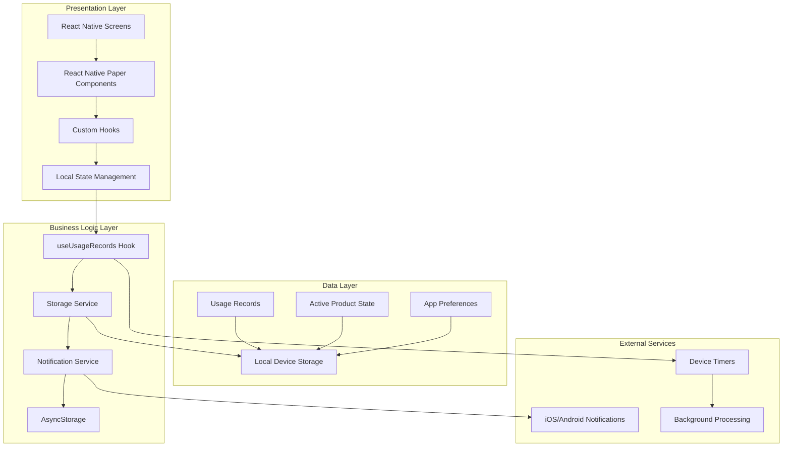
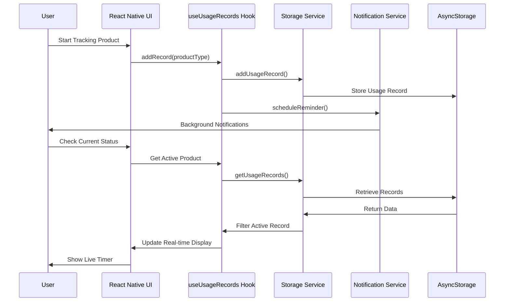
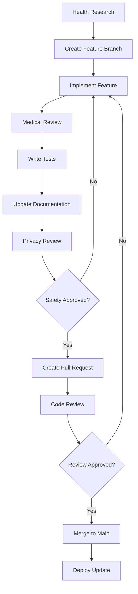

<div align="center"><a name="readme-top"></a>

[](#)

# 🩸 FemTracker<br/><h3>Smart Menstrual Product Safety Tracker</h3>

A cutting-edge mobile application that revolutionizes menstrual health management through real-time usage tracking and intelligent safety monitoring.<br/>
Supports tampon and menstrual cup tracking with personalized alerts and comprehensive usage analytics.<br/>
One-click **FREE** deployment for immediate health safety monitoring.

[Try Demo][demo-link] · [Features](#-key-features) · [Download](#-getting-started) · [Documentation](#-usage-guide) · [Issues][github-issues-link]

<br/>

[](https://github.com/ChanMeng666/femtracker/releases/tag/version1.0.0)

<br/>

<!-- SHIELD GROUP -->

[![][github-release-shield]][github-release-link]
[![][expo-shield]][expo-link]
[![][react-native-shield]][react-native-link]
[![][typescript-shield]][typescript-link]<br/>
[![][github-contributors-shield]][github-contributors-link]
[![][github-forks-shield]][github-forks-link]
[![][github-stars-shield]][github-stars-link]
[![][github-issues-shield]][github-issues-link]
[![][github-license-shield]][github-license-link]<br>
[![][sponsor-shield]][sponsor-link]

**Share FemTracker**

[![][share-x-shield]][share-x-link]
[![][share-telegram-shield]][share-telegram-link]
[![][share-whatsapp-shield]][share-whatsapp-link]
[![][share-reddit-shield]][share-reddit-link]
[![][share-linkedin-shield]][share-linkedin-link]

<sup>🌟 Pioneering the future of menstrual health technology. Built for women's safety and empowerment.</sup>

[![][github-trending-shield]][github-trending-url]

## 📸 App Screenshots

> [!TIP]
> Experience the clean, intuitive interface designed specifically for menstrual health tracking.

<div align="center">
  
  
  
  <p><em>Main Interface - Product Selection, Active Monitoring, and Usage History</em></p>
</div>

<details>
<summary><kbd>📱 More Screenshots</kbd></summary>

<div align="center">
  
  <p><em>Interactive Demo Showcasing Core Features</em></p>
</div>

</details>

## 🎬 Demo Video

> [!NOTE]
> Watch FemTracker in action - from initial setup to real-time tracking and safety alerts.

<div align="center">

[](https://github.com/ChanMeng666/femtracker/releases/tag/version1.0.0)

*Click the image above to see the full demo experience*

</div>

**Tech Stack Badges:**

<div align="center">

 
 
 
 
 
 

</div>

</div>

> [!IMPORTANT]
> FemTracker demonstrates modern mobile health app development with React Native and Expo. It combines real-time tracking with intelligent safety alerts to provide comprehensive menstrual product monitoring. Features include usage timers, smart notifications, offline data storage, and detailed usage analytics.

<details>
<summary><kbd>📑 Table of Contents</kbd></summary>

#### TOC

- [🩸 FemTracker](#-femtracker)
      - [TOC](#toc)
  - [🌟 Introduction](#-introduction)
  - [✨ Key Features](#-key-features)
    - [`1` Real-time Usage Tracking](#1-real-time-usage-tracking)
    - [`2` Smart Safety Alerts](#2-smart-safety-alerts)
    - [`*` Additional Features](#-additional-features)
  - [🛠️ Tech Stack](#️-tech-stack)
  - [🏗️ Architecture](#️-architecture)
    - [App Architecture](#app-architecture)
    - [Data Flow](#data-flow)
    - [Component Structure](#component-structure)
  - [⚡️ Performance](#️-performance)
  - [🚀 Getting Started](#-getting-started)
    - [Prerequisites](#prerequisites)
    - [Quick Installation](#quick-installation)
    - [Development Mode](#development-mode)
  - [📦 Build & Deployment](#-build--deployment)
    - [`A` Expo Development Build](#a-expo-development-build)
    - [`B` Production Build](#b-production-build)
    - [`C` App Store Deployment](#c-app-store-deployment)
  - [📖 Usage Guide](#-usage-guide)
    - [Basic Usage](#basic-usage)
    - [Safety Guidelines](#safety-guidelines)
    - [Understanding Alerts](#understanding-alerts)
  - [🔌 Health Integrations](#-health-integrations)
  - [⌨️ Development](#️-development)
    - [Local Development](#local-development)
    - [Adding Features](#adding-features)
    - [Testing](#testing)
  - [🤝 Contributing](#-contributing)
    - [Development Process](#development-process)
    - [Contribution Guidelines](#contribution-guidelines)
  - [❤️ Sponsor](#️-sponsor)
  - [📄 License](#-license)
  - [👥 Team](#-team)

####

<br/>

</details>

## 🌟 Introduction

We are passionate developers creating next-generation menstrual health solutions. By adopting modern mobile development practices and evidence-based health guidelines, we aim to provide users with powerful, safe, and user-friendly tracking tools.

Whether you're looking to monitor your menstrual product usage for safety or track patterns for health insights, FemTracker will be your trusted health companion. Please note that this app is designed to complement, not replace, professional medical advice.

> [!NOTE]
> - Node.js >= 18.0 required for development
> - Expo CLI required for mobile development
> - iOS 13+ or Android 9+ for optimal performance
> - No account required - all data stored locally for privacy

| [![][demo-shield-badge]][demo-link]   | No installation required! Try our web demo to experience it firsthand.                           |
| :------------------------------------ | :--------------------------------------------------------------------------------------------- |
| [![][health-shield-badge]][health-link] | Join our community dedicated to menstrual health awareness and technology. |

> [!TIP]
> **⭐ Star us** to receive all health app updates and new feature notifications from GitHub!

[![][image-star]][github-stars-link]

<details>
  <summary><kbd>⭐ Star History</kbd></summary>
  <picture>
    <source media="(prefers-color-scheme: dark)" srcset="https://api.star-history.com/svg?repos=ChanMeng666%2Ffemtracker&theme=dark&type=Date">
    
  </picture>
</details>

## ✨ Key Features

### `1` Real-time Usage Tracking

Experience next-generation menstrual product monitoring with live duration tracking and visual status indicators. Our innovative timer system provides unprecedented safety awareness through advanced real-time calculations and intuitive visual feedback.

<div align="center">
  
  <p><em>Live usage tracking with color-coded safety status</em></p>
</div>

Key capabilities include:
- 🚀 **Live Timers**: Real-time countdown and elapsed time tracking
- 🔧 **Product Support**: Tampons (6-8 hours) and Menstrual Cups (10-12 hours)
- 📱 **Visual Indicators**: Color-coded status (green/yellow/red) for safety awareness
- 🛡️ **Privacy First**: All tracking data stored locally on your device

> [!TIP]
> The app features beautiful Lottie animations and smooth transitions to make health tracking engaging and stress-free.

[![][back-to-top]](#readme-top)

### `2` Smart Safety Alerts

Revolutionary alert system that transforms menstrual product safety through intelligent monitoring and evidence-based recommendations. With our advanced notification algorithms and health-focused design, users can maintain optimal safety while receiving timely guidance.

<div align="center">
  
  <p><em>Intelligent alerts for recommended and maximum usage times</em></p>
</div>

**Alert Types:**
- **Recommended Change**: Gentle reminders at optimal replacement times
- **Maximum Limit**: Critical warnings to prevent health risks

[![][back-to-top]](#readme-top)

### `*` Additional Features

Beyond core tracking, FemTracker includes:

- [x] 📊 **Usage History**: Comprehensive log of all tracked sessions with detailed analytics
- [x] 🔒 **Privacy First**: No accounts, no cloud storage - everything stays on your device
- [x] 💎 **Material Design**: Beautiful UI following Google's Material Design 3 guidelines
- [x] 🌐 **Offline Support**: Full functionality without internet connection
- [x] 📱 **Cross-Platform**: Works seamlessly on iOS and Android
- [x] ⏰ **Flexible Timing**: Support for different product types with appropriate time limits
- [x] 🎨 **Custom Theming**: Brand-aware design system with accessibility in mind
- [x] 🔔 **Smart Notifications**: Background alerts even when app is closed

> ✨ More health tracking features are continuously being added based on user feedback and medical research.

<div align="right">

[![][back-to-top]](#readme-top)

</div>

## 🛠️ Tech Stack

<div align="center">
  <table>
    <tr>
      <td align="center" width="96">
        
        <br>React Native 0.76
      </td>
      <td align="center" width="96">
        
        <br>Expo 52
      </td>
      <td align="center" width="96">
        
        <br>TypeScript 5.3
      </td>
      <td align="center" width="96">
        
        <br>React Native Paper
      </td>
      <td align="center" width="96">
        
        <br>Lottie React Native
      </td>
    </tr>
  </table>
</div>

**Frontend Stack:**
- **Framework**: React Native 0.76 with Expo Router
- **Language**: TypeScript for complete type safety
- **UI Library**: React Native Paper (Material Design 3)
- **Navigation**: Expo Router with TypeScript support
- **Animations**: Lottie React Native + React Native Reanimated
- **Storage**: AsyncStorage for local data persistence

**Development Stack:**
- **Platform**: Expo SDK 52 with EAS Build
- **State Management**: Custom hooks with React hooks
- **Architecture**: Clean architecture with service layer
- **Testing**: Jest with Expo testing utilities
- **Code Quality**: ESLint + TypeScript strict mode

**Health & Safety Features:**
- **Timer System**: Precise millisecond tracking
- **Notification System**: Expo Notifications for alerts
- **Data Privacy**: Local-only storage with no external dependencies
- **Accessibility**: Full screen reader and accessibility support

> [!TIP]
> Each technology was carefully selected for mobile health app requirements, focusing on reliability, privacy, and user safety.

## 🏗️ Architecture

### App Architecture

> [!TIP]
> This architecture prioritizes user privacy and data security while maintaining high performance for real-time health tracking.



### Data Flow



### Component Structure

<div align="center">
  
  <p><em>Clean, privacy-focused mobile health architecture</em></p>
</div>

```
femtracker/
├── app/                      # Expo Router pages
│   ├── (tabs)/              # Tab navigation
│   │   ├── index.tsx        # Main tracking screen
│   │   └── explore.tsx      # Usage history
│   └── _layout.tsx          # Root layout with theming
├── components/              # Reusable UI components
│   └── BrandButton.tsx      # Custom branded button
├── hooks/                   # Custom React hooks
│   └── useUsageRecords.ts   # Main tracking logic
├── services/               # Business logic services
│   ├── storage.ts          # AsyncStorage wrapper
│   └── notification.ts     # Alert management
├── constants/              # App constants
│   ├── index.ts            # Product types & limits
│   └── Colors.ts           # Color definitions
├── types/                  # TypeScript definitions
│   └── index.ts            # Usage record types
├── src/theme/              # Design system
│   └── index.ts            # Complete theme config
└── assets/                 # Static resources
    ├── images/             # App icons & images
    └── Lottie/             # Animation files
```

## ⚡️ Performance

> [!NOTE]
> FemTracker is optimized for battery efficiency and real-time accuracy, crucial for health tracking applications.

### Performance Metrics

**Key Performance Indicators:**
- ⚡ **< 2s** App startup time on modern devices
- 🔋 **Minimal Battery Impact** with efficient background processing
- 💾 **< 5MB** Total app size for quick downloads
- 📊 **Real-time Updates** with < 100ms timer accuracy
- 🔄 **Instant Sync** between app states and notifications

**Performance Optimizations:**
- 🎯 **Efficient Timers**: Optimized JavaScript timers for battery life
- 📦 **Small Bundle Size**: Tree-shaking and code splitting
- 🖼️ **Optimized Assets**: Compressed images and efficient Lottie animations
- 🔄 **Background Processing**: Smart notification scheduling

> [!NOTE]
> Performance metrics are continuously monitored to ensure optimal health tracking experience.

## 🚀 Getting Started

### Prerequisites

> [!IMPORTANT]
> Ensure you have the following installed for development:

- Node.js 18.0+ ([Download](https://nodejs.org/))
- npm/yarn/pnpm package manager
- Expo CLI ([Installation Guide](https://docs.expo.dev/get-started/installation/))
- iOS Simulator (macOS) or Android Studio (all platforms)

### Quick Installation

**1. Clone Repository**

```bash
git clone https://github.com/ChanMeng666/femtracker.git
cd femtracker
```

**2. Install Dependencies**

```bash
# Using npm
npm install

# Using yarn
yarn install

# Using pnpm (recommended)
pnpm install
```

**3. Start Development**

```bash
npx expo start
```

**4. Run on Device**

```bash
# iOS Simulator
npx expo start --ios

# Android Emulator
npx expo start --android

# Physical Device (scan QR code with Expo Go)
npx expo start
```

🎉 **Success!** The app will load on your chosen platform with hot reloading enabled.

### Development Mode

```bash
# Start with different options
npx expo start                # Default development server
npx expo start --clear        # Clear Metro bundler cache
npx expo start --offline      # Offline mode
npx expo start --lan         # LAN mode for device testing

# Run tests
npm test                      # Jest unit tests
npm run lint                  # ESLint code quality check
npm run type-check           # TypeScript validation
```

## 📦 Build & Deployment

> [!IMPORTANT]
> FemTracker uses EAS (Expo Application Services) for professional app building and distribution.

### `A` Expo Development Build

```bash
# Install EAS CLI
npm install -g @expo/eas-cli

# Login to Expo
eas login

# Create development build
eas build --profile development --platform ios
eas build --profile development --platform android
```

### `B` Production Build

```bash
# Create production builds
eas build --profile production --platform all

# Submit to app stores
eas submit --platform ios
eas submit --platform android
```

### `C` App Store Deployment

**App Store Connect (iOS):**
- Automatic submission via EAS Submit
- Review guidelines compliance for health apps
- Privacy policy and data usage declaration

**Google Play Console (Android):**
- APK/AAB upload via EAS Submit
- Health app category selection
- Medical device disclaimer (if required)

> [!WARNING]
> Health tracking apps may require additional review processes and medical disclaimers depending on your target markets.

## 📖 Usage Guide

### Basic Usage

**Getting Started with Tracking:**

1. **Select Product Type** - Choose between tampon or menstrual cup
2. **Start Tracking** - Tap "Insert" when you begin using the product
3. **Monitor Status** - Watch real-time timer and color-coded safety indicators
4. **Receive Alerts** - Get notifications at recommended and maximum usage times
5. **Record Removal** - Tap "Record Removal" when changing products

#### User Interface Walkthrough

<div align="center">
  
  
  
  <p><em>Step-by-step: Product Selection → Active Tracking → History Review</em></p>
</div>

### Safety Guidelines

**Understanding Usage Limits:**

| Product Type | Recommended Time | Maximum Time | Health Risk |
|--------------|------------------|--------------|-------------|
| **Tampons** | 6 hours | 8 hours | TSS (Toxic Shock Syndrome) |
| **Menstrual Cups** | 10 hours | 12 hours | Bacterial growth, discomfort |

> [!WARNING]
> These limits are based on medical guidelines. Always consult healthcare providers for personalized advice.

### Understanding Alerts

**Color-Coded Status System:**

- 🟢 **Green (Safe)**: Within recommended usage time
- 🟡 **Yellow (Caution)**: Approaching recommended limit
- 🔴 **Red (Warning)**: At or exceeding maximum safe usage time

**Alert Types:**

```typescript
// Recommended Change Alert
"Tampon has been used for 6 hours. Consider changing for optimal hygiene."

// Maximum Limit Warning
"WARNING! Tampon has reached 8-hour maximum limit. 
Please change immediately to avoid health risks!"
```

## 🔌 Health Integrations

Future integrations planned for comprehensive menstrual health tracking:

| Category | Service | Status | Description |
|----------|---------|--------|-------------|
| **Health Data** | Apple HealthKit | 🔄 Planned | Sync cycle data with iOS Health |
| **Health Data** | Google Fit | 🔄 Planned | Android health data integration |
| **Analytics** | Period Prediction | 🔄 Planned | AI-powered cycle predictions |
| **Emergency** | Emergency Contacts | 🔄 Planned | Critical alert emergency features |
| **Education** | Health Resources | 🔄 Planned | Educational content integration |

> 📊 Future integrations will maintain our privacy-first approach with user consent.

## ⌨️ Development

### Local Development

**Setup Development Environment:**

```bash
# Clone and setup
git clone https://github.com/ChanMeng666/femtracker.git
cd femtracker
npm install

# Start development
npx expo start

# Additional development commands
npm run ios          # iOS simulator
npm run android      # Android emulator
npm run web          # Web development (limited features)
```

**Development Scripts:**

```bash
# Development
npm start            # Start Expo dev server
npm run ios          # iOS simulator
npm run android      # Android emulator
npm run web          # Web browser (testing only)

# Code Quality
npm run lint         # ESLint checks
npm run lint:fix     # Fix ESLint issues
npm test             # Jest unit tests
npm run type-check   # TypeScript validation

# Build & Deploy
npx eas build        # Production build
npx eas submit       # App store submission
```

### Adding Features

> [!TIP]
> Follow our health-focused development workflow to ensure medical accuracy and user safety.



### Testing

**Unit Testing:**

```typescript
// __tests__/hooks/useUsageRecords.test.ts
import { renderHook, act } from '@testing-library/react-hooks';
import { useUsageRecords } from '@/hooks/useUsageRecords';

describe('useUsageRecords', () => {
  it('tracks tampon usage correctly', async () => {
    const { result } = renderHook(() => useUsageRecords());
    
    await act(async () => {
      await result.current.addRecord('tampon');
    });

    expect(result.current.activeProduct).toBeTruthy();
    expect(result.current.activeProduct?.productType).toBe('tampon');
  });
});
```

## 🤝 Contributing

We welcome contributions to improve menstrual health technology! Here's how you can help:

### Development Process

**1. Fork & Clone:**

```bash
git clone https://github.com/ChanMeng666/femtracker.git
cd femtracker
```

**2. Create Health-Focused Branch:**

```bash
git checkout -b feature/health-improvement-name
```

**3. Make Changes:**

- Follow medical accuracy guidelines
- Add comprehensive tests for health features
- Update safety documentation
- Ensure privacy compliance

**4. Submit PR:**

- Include medical research citations
- Provide safety testing results
- Reference health guidelines followed
- Ensure accessibility compliance

### Contribution Guidelines

**Health App Standards:**
- Research-backed health recommendations
- Privacy-first data handling
- Accessibility for all users
- Clear medical disclaimers

**Code Quality:**
- TypeScript for type safety
- Unit tests for critical health features
- Documentation updates
- Performance optimization

[![][pr-welcome-shield]][pr-welcome-link]

<a href="https://github.com/ChanMeng666/femtracker/graphs/contributors" target="_blank">
  <table>
    <tr>
      <th colspan="2">
        <br><br><br>
      </th>
    </tr>
  </table>
</a>

## ❤️ Sponsor

Support menstrual health technology development and help us continue building life-changing tools for women worldwide!

**Sponsor Benefits:**
- 🎯 **Early Access**: Try new health features first
- 🚀 **Priority Support**: Get help with health app development
- 📊 **Research Access**: Participate in menstrual health studies
- 🏷️ **Recognition**: Logo placement in health app ecosystem
- 💬 **Direct Input**: Influence health feature development

## 📄 License

This project is licensed under the Apache License 2.0 - see the [LICENSE](LICENSE) file for details.

**Open Source Health Benefits:**
- ✅ Transparent health algorithms
- ✅ Community-driven safety improvements
- ✅ Educational use permitted
- ✅ Medical research applications allowed

## 👥 Team

<div align="center">
  <table>
    <tr>
      <td align="center">
        <a href="https://github.com/ChanMeng666">
          
          <br />
          <sub><b>Chan Meng</b></sub>
        </a>
        <br />
        <small>Creator & Lead Developer</small>
        <br />
        <small>Menstrual Health Technology Advocate</small>
      </td>
    </tr>
  </table>
</div>

## 🙋‍♀️ Author

**Chan Meng**
-  LinkedIn: [chanmeng666](https://www.linkedin.com/in/chanmeng666/)
-  GitHub: [ChanMeng666](https://github.com/ChanMeng666)
-  Email: [chanmeng.dev@gmail.com](mailto:chanmeng.dev@gmail.com)
-  Website: [chanmeng.live](https://2d-portfolio-eta.vercel.app/)

**Contact Information:**
- 📧 **Health Inquiries**: For medical questions, consult healthcare providers
- 💼 **Partnership**: Open to menstrual health organizations
- 🐦 **Updates**: Follow for menstrual health tech news
- 💬 **Community**: Join our health-focused developer community

## 🚨 Medical Disclaimer

> [!IMPORTANT]
> **Medical Disclaimer**: FemTracker is designed as a tracking tool and educational resource. It is not intended to diagnose, treat, cure, or prevent any medical condition. Always consult with qualified healthcare providers for medical advice, diagnosis, and treatment decisions.

**Health Guidelines:**
- Tampon safety limits based on CDC and WHO guidelines
- Menstrual cup recommendations from manufacturer guidelines
- TSS (Toxic Shock Syndrome) awareness and prevention
- Individual health needs may vary - consult your doctor

## 📚 Health Resources

<details>
<summary><kbd>📖 Menstrual Health Education</kbd></summary>

**Important Health Information:**

**Toxic Shock Syndrome (TSS):**
- Rare but serious bacterial infection
- Associated with tampon use, especially super-absorbent tampons
- Symptoms: sudden fever, vomiting, diarrhea, rash
- Prevention: Use lowest absorbency needed, change regularly

**Menstrual Cup Safety:**
- Generally safe when used properly
- Clean hands before insertion/removal
- Sterilize between cycles
- Replace according to manufacturer guidelines

**When to Seek Medical Attention:**
- Unusual discharge or odor
- Persistent pelvic pain
- Signs of infection
- Any concerning symptoms

</details>

---

<div align="center">
<strong>🩸 Revolutionizing Menstrual Health Technology 🌟</strong>
<br/>
<em>Empowering women through safe, smart tracking</em>
<br/><br/>

⭐ **Star us on GitHub** • 📖 **Read Health Guidelines** • 🐛 **Report Issues** • 💡 **Suggest Features** • 🤝 **Contribute to Women's Health**

<br/><br/>

**Made with ❤️ for women's health and safety**


</div>

---

<!-- LINK DEFINITIONS -->

[back-to-top]: https://img.shields.io/badge/-BACK_TO_TOP-151515?style=flat-square

<!-- Project Links -->
[demo-link]: https://github.com/ChanMeng666/femtracker/releases/tag/version1.0.0
[health-link]: https://github.com/ChanMeng666/femtracker/discussions

<!-- GitHub Links -->
[github-issues-link]: https://github.com/ChanMeng666/femtracker/issues
[github-stars-link]: https://github.com/ChanMeng666/femtracker/stargazers
[github-forks-link]: https://github.com/ChanMeng666/femtracker/forks
[github-contributors-link]: https://github.com/ChanMeng666/femtracker/contributors
[github-release-link]: https://github.com/ChanMeng666/femtracker/releases
[pr-welcome-link]: https://github.com/ChanMeng666/femtracker/pulls
[github-license-link]: https://github.com/ChanMeng666/femtracker/blob/master/LICENSE

<!-- External Links -->
[expo-link]: https://expo.dev/
[react-native-link]: https://reactnative.dev/
[typescript-link]: https://www.typescriptlang.org/
[sponsor-link]: https://github.com/sponsors/ChanMeng666

<!-- Shield Badges -->
[github-release-shield]: https://img.shields.io/github/v/release/ChanMeng666/femtracker?color=FF4B6E&labelColor=black&logo=github&style=flat-square
[expo-shield]: https://img.shields.io/badge/expo-52.0.7-000020?labelColor=black&logo=expo&style=flat-square
[react-native-shield]: https://img.shields.io/badge/react--native-0.76.2-61DAFB?labelColor=black&logo=react&style=flat-square
[typescript-shield]: https://img.shields.io/badge/typescript-5.3.3-007ACC?labelColor=black&logo=typescript&style=flat-square
[github-contributors-shield]: https://img.shields.io/github/contributors/ChanMeng666/femtracker?color=c4f042&labelColor=black&style=flat-square
[github-forks-shield]: https://img.shields.io/github/forks/ChanMeng666/femtracker?color=8ae8ff&labelColor=black&style=flat-square
[github-stars-shield]: https://img.shields.io/github/stars/ChanMeng666/femtracker?color=ffcb47&labelColor=black&style=flat-square
[github-issues-shield]: https://img.shields.io/github/issues/ChanMeng666/femtracker?color=ff80eb&labelColor=black&style=flat-square
[github-license-shield]: https://img.shields.io/badge/license-Apache%202.0-white?labelColor=black&style=flat-square
[sponsor-shield]: https://img.shields.io/badge/-Sponsor%20Project-f04f88?logo=github&logoColor=white&style=flat-square
[github-trending-shield]: https://img.shields.io/badge/trending-femtracker-FF4B6E?labelColor=black&style=flat-square
[pr-welcome-shield]: https://img.shields.io/badge/🤝_PRs_welcome-%E2%86%92-ffcb47?labelColor=black&style=for-the-badge

<!-- Badge Variants -->
[demo-shield-badge]: https://img.shields.io/badge/TRY%20DEMO-ONLINE-FF4B6E?labelColor=black&logo=expo&style=for-the-badge
[health-shield-badge]: https://img.shields.io/badge/HEALTH%20COMMUNITY-JOIN-FF6B9D?labelColor=black&logo=heart&style=for-the-badge

<!-- Social Share Links -->
[share-x-link]: https://x.com/intent/tweet?hashtags=menstrualhealth,femtech,opensource&text=Check%20out%20FemTracker%20-%20Smart%20Menstrual%20Product%20Safety%20Tracker&url=https%3A%2F%2Fgithub.com%2FChanMeng666%2Ffemtracker
[share-telegram-link]: https://t.me/share/url?text=Check%20out%20FemTracker%20-%20Smart%20Menstrual%20Health%20Tracker&url=https%3A%2F%2Fgithub.com%2FChanMeng666%2Ffemtracker
[share-whatsapp-link]: https://api.whatsapp.com/send?text=Check%20out%20FemTracker%20-%20Smart%20Menstrual%20Health%20Tracker%20https%3A%2F%2Fgithub.com%2FChanMeng666%2Ffemtracker
[share-reddit-link]: https://www.reddit.com/submit?title=FemTracker%20-%20Smart%20Menstrual%20Product%20Safety%20Tracker&url=https%3A%2F%2Fgithub.com%2FChanMeng666%2Ffemtracker
[share-linkedin-link]: https://linkedin.com/sharing/share-offsite/?url=https://github.com/ChanMeng666/femtracker

[share-x-shield]: https://img.shields.io/badge/-share%20on%20x-black?labelColor=black&logo=x&logoColor=white&style=flat-square
[share-telegram-shield]: https://img.shields.io/badge/-share%20on%20telegram-black?labelColor=black&logo=telegram&logoColor=white&style=flat-square
[share-whatsapp-shield]: https://img.shields.io/badge/-share%20on%20whatsapp-black?labelColor=black&logo=whatsapp&logoColor=white&style=flat-square
[share-reddit-shield]: https://img.shields.io/badge/-share%20on%20reddit-black?labelColor=black&logo=reddit&logoColor=white&style=flat-square
[share-linkedin-shield]: https://img.shields.io/badge/-share%20on%20linkedin-black?labelColor=black&logo=linkedin&logoColor=white&style=flat-square

<!-- Images -->
[image-star]: https://github.com/ChanMeng666/femtracker/blob/main/assets/images/icon-192.png?raw=true

<!-- Trending -->
[github-trending-url]: https://github.com/ChanMeng666/femtracker
</div>
