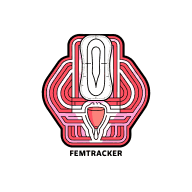

# FemTracker



FemTracker is a modern mobile application designed to help users track and manage their menstrual product usage safely. Built with React Native and Expo, it provides real-time duration tracking, smart notifications, and usage history for better period care practices.


## Features

- **Real-time Usage Tracking**: Monitor the duration of tampon and menstrual cup usage
- **Smart Reminders**: Receive notifications for recommended and maximum usage times
- **Usage History**: View and track your product usage patterns over time
- **Clean UI**: Modern, intuitive interface with clear status indicators
- **Safety First**: Built-in timers and warnings to prevent extended use
- **Offline Support**: All data stored locally on your device

## Tech Stack

- React Native
- Expo
- TypeScript
- React Native Paper
- AsyncStorage
- Expo Notifications
- Linear Gradient
- Lottie Animations

## Getting Started

### Prerequisites

- Node.js (v14 or later)
- npm or yarn
- Expo CLI
- iOS Simulator (for iOS development)
- Android Studio and Android SDK (for Android development)

### Installation

1. Clone the repository
   ```bash
   git clone https://github.com/ChanMeng666/FemTracker.git
   cd FemTracker
   ```

2. Install dependencies
   ```bash
   npm install
   # or
   yarn install
   ```

3. Start the development server
   ```bash
   npx expo start
   ```

4. Run on your preferred platform
   - Press `i` for iOS simulator
   - Press `a` for Android emulator
   - Scan QR code with Expo Go app for physical device

## Project Structure

```
FemTracker/
├── app/                   # Main application screens
├── assets/               # Images, fonts, and other static files
├── components/           # Reusable UI components
├── constants/            # App constants and configurations
├── hooks/               # Custom React hooks
├── services/            # Core services (storage, notifications)
├── src/                 # Source files
│   └── theme/           # UI theme and styling
└── types/               # TypeScript type definitions
```

## Architecture

The app follows a clean architecture pattern with:
- Hooks for business logic and state management
- Services for core functionalities
- Local storage for data persistence
- Theme-based styling system
- Type-safe development with TypeScript

## Contributing

Contributions are welcome! Please feel free to submit a Pull Request. For major changes, please open an issue first to discuss what you would like to change.

1. Fork the repository
2. Create your feature branch (`git checkout -b feature/AmazingFeature`)
3. Commit your changes (`git commit -m 'Add some AmazingFeature'`)
4. Push to the branch (`git push origin feature/AmazingFeature`)
5. Open a Pull Request

## License

This project is licensed under the MIT License - see the [LICENSE](LICENSE) file for details.

## Acknowledgments

- [Expo](https://expo.dev/) for the amazing development platform
- [React Native Paper](https://callstack.github.io/react-native-paper/) for the Material Design components
- All contributors who have helped shape this project

## Author

**Chan Meng**

- LinkedIn: [chanmeng666](https://www.linkedin.com/in/chanmeng666/)
- GitHub: [ChanMeng666](https://github.com/ChanMeng666)
